# 코리아 IT 아카데미 정처기
## 1. 프로젝트 제목 - 미소코코샵
 - 🐱‍🐉 자바를 활용한 콘솔 프로그램 만들기 – 펫 상품 판매 사이트
<p align="center">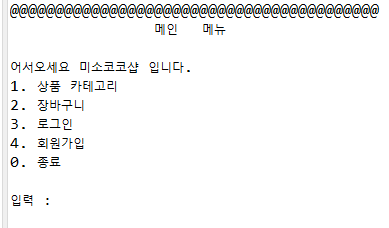</p>

## 2. 프로젝트 정보
- 코리아IT아카데미 정보처리기능사 프로젝트

 - 애플리케이션 주요 기능
    1. 상품 카테고리
        - 카테고리 별로 .txt 파일 내에 저장된 내용을 가져와 보여주는 기능 구현
    2. 장바구니
        - 상품을 바로 구매하지 않고 장바구니에 보관했다가 장바구니 메뉴에서 전체 구매하는 기능 구현
    3. 상품 구매
        - 선택한 상품을 바로 구매하고 구매영수증이 나오는 기능 구현
    4. 로그인 / 로그아웃 / 회원가입
        - 파일 내 .txt 파일에 ID와 PW를 저장하고 가져와 로그인 하는 기능 구현
    5. 관리자ID & 관리자 메뉴
        - 관리자ID를 따로 만들고 관리자로 로그인 했을 시에 관리자 메뉴가 보이는 기능 구현
    6. 상품 수정 & 삭제
        - 관리자로 로그인 했을 시 상품을 수정 및 삭제 할 수 있는 기능 구현


## 3. 프로젝트 소개
### 실제 쇼핑몰 페이지를 참고하여 자바에서 기능 구현
    - Eclipse를 통해 실제 페이지를 보고 어떤 기능이 있는지 참고하여 기능을 구현했습니다.

## 4. 시작 가이드
### 요구 사항
- Eclipse IDE
- Java Version : 17

### Installation
```
C 드라이브에 workspace 다운로드 (C:\workspace)
Eclipse IDE 실행 후 ShopApp.java Run
```


## 5. 기술 스택
### Environment


## 6. 화면 구성
| 메인 페이지         | 상품 메뉴 페이지       |
|------------------|------------------|
| 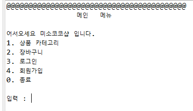 | 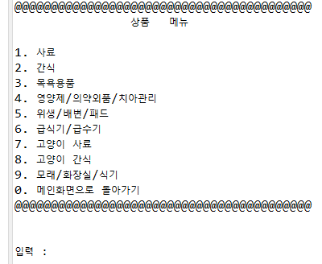 |
| 상품 구매 페이지     | 장바구니 페이지       |
| 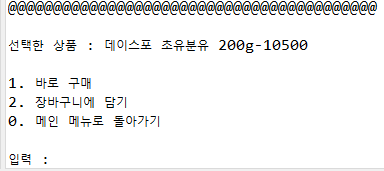 | 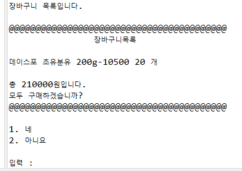 |
| 구매 영수증 | 로그인 및 관리자 메뉴     |
| 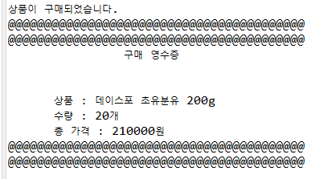 | 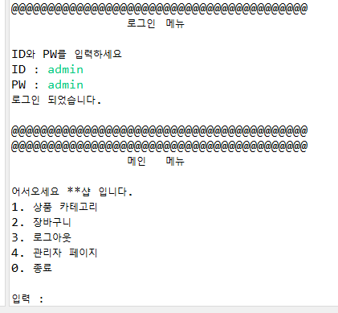 |
| 관리자 메뉴  | 회원가입             |
| 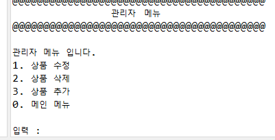 | 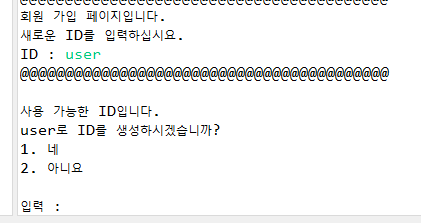 |
| 마이페이지 | 비밀번호 변경 |
| 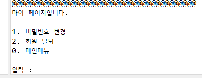 | 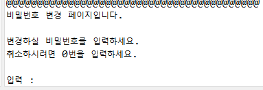 |


## 07. 아키텍쳐
### 디렉터리 구조
```
C:.
└─ShopApp
    ├─.settings
    ├─bin
    └─src
        ├─controller
        │  └─ShopController.java    - 컨트롤러 클래스
        ├─dto
        │  └─ShopDto.java
        ├─main
        │  └─ShopApp.java
        ├─service
        │  ├─BuyService.java        - 구매 관련 클래스
        │  ├─CartService.java       - 장바구니 관련 클래스
        │  ├─CreateService.java     - 상품 추가 클래스
        │  ├─DeleteService.java     - 상품 제거 클래스
        │  ├─FileReadWrite.java     - 파일을 불러오고 저장하는 클래스
        │  ├─LoginService.java      - 로그인 클래스
        │  ├─ShopRepoFile.java      - ShopService 를 구현해주는 클래스
        │  ├─ShopService.java       - 서비스 인터페이스
        │  ├─UpdateService.java     - 상품 수정 클래스
        │  └─fileRepo               - 파일 저장소
        │      ├─bath
        │      ├─catFeed
        │      ├─catSnack
        │      ├─catsOf
        │      ├─feed
        │      ├─feeder
        │      ├─login
        │      ├─pottyPad
        │      ├─snack
        │      └─supplements
        └─view
            ├─MainView.java             - 메인 뷰
            ├─admin
            │   ├─AdminView.java        - 관리자 메인 뷰
            │   ├─CreateView.java       - 상품 생성 뷰
            │   ├─DeleteView.java       - 상품 삭제 뷰
            │   └─UpdateView.java       - 상품 수정 뷰
            ├─category01                - 상품 카테고리 뷰
            │   └─FeedView.java
            ├─category02
            │   └─SnackView.java
            ├─category03
            │   └─BathView.java
            ├─category04
            │   └─SupplementsView.java
            ├─category05
            │   └─PottyPadView.java
            ├─category06
            │   └─FeederView.java
            ├─category07
            │   └─CarFeedView.java
            ├─category08
            │   └─CatSnackView.java
            └─category09
                └─CatsOf.java

```
